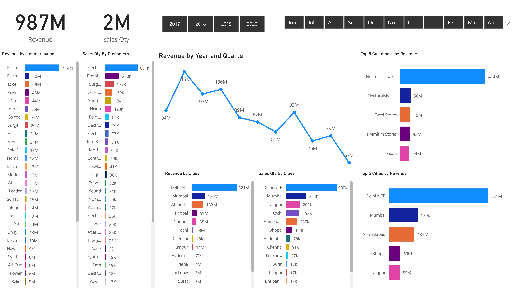

  <h1 align=center>Computer Hardware Sales PowerBI Dashboard</h1>
    
  

  <h2>Overview</h2>

  
This project revolves around creating a responsive Power BI dashboard to address the sales challenges faced by a computer hardware business operating in a dynamically changing market. The goal is to provide real-time sales insights to the sales director, enabling data-driven decision-making and strategic planning.

  <h2>Features</h2>

  <ul>
        <li><strong>Responsive Design:</strong> The dashboard is designed to adapt seamlessly to various screen sizes, ensuring accessibility across different devices.</li>
        <li><strong>Real-time Sales Insights:</strong> Utilizing the power of Power BI, the dashboard provides up-to-date sales data and trends, enabling timely decision-making.</li>
        <li><strong>Customizable Visualizations:</strong> The dashboard includes a variety of customizable visualizations such as charts, graphs, and tables, allowing users to analyze sales data from different perspectives.</li>
        <li><strong>Interactive Filters:</strong> Users can apply interactive filters to drill down into specific regions, product categories, or time periods, gaining deeper insights into sales performance.</li>
  </ul>

  <h2>How to Use</h2>

  <ol>
        <li><strong>Accessing the Dashboard:</strong> You can access the live dashboard <a href="https://app.powerbi.com/groups/me/reports/265a8d0d-b773-4f73-b9ef-b2ebf75273ec/ReportSection?bookmarkGuid=28fc062f-b879-4761-ae0b-942039fa9c9f&bookmarkUsage=1&ctid=509b255b-13b3-4af4-bd94-9536cca3c61f&portalSessionId=cb962129-c624-4b9c-bf88-01fa2ce3fb8c&fromEntryPoint=export)">here</a>.</li>
        <li><strong>Navigating the Dashboard:</strong>
    <h2>Technologies Used</h2>     
    <ul>
                <li>Upon accessing the dashboard, you'll be greeted with an overview of key sales metrics.</li>
                <li>Use the interactive filters to narrow down the data based on your specific requirements.</li>
                <li>Explore different tabs and visualizations to gain insights into sales performance across different dimensions.</li>
    </ul>
       

  <ul>
        <li><strong>Power BI:</strong> Used for data visualization and dashboard creation.</li>
        <li><strong>Microsoft Excel:</strong> Used for data preprocessing and cleaning.</li>
        <li><strong>MySQL:</strong> Used for data preprocessing and cleaning.</li>
        <li><strong>Python(Pandas):</strong> Used for data preprocessing and cleaning.</li>
  </ul>

  <h2>Future Enhancements</h2>

  <ul>
        <li><strong>Integration with External Data Sources:</strong> Explore options for integrating external data sources to enrich sales insights.</li>
        <li><strong>Predictive Analytics:</strong> Implement predictive analytics models to forecast future sales trends.</li>
        <li><strong>Enhanced Interactivity:</strong> Incorporate additional interactive features to enhance user experience.</li>
  </ul>

